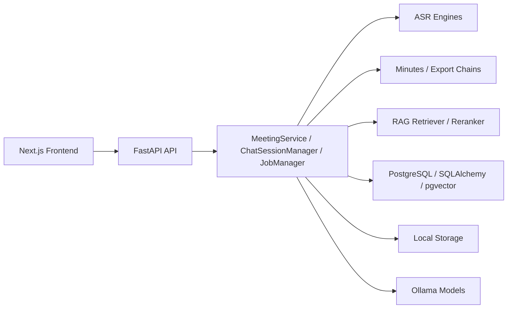
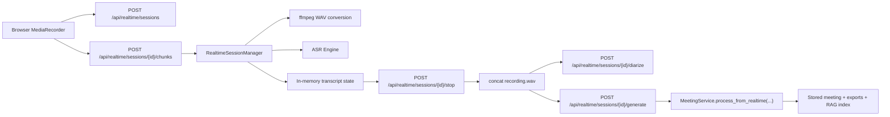
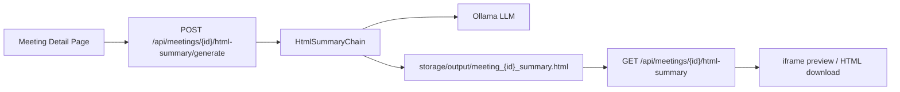

# Meeting Agent Architecture

## Overview

Meeting Agent runs on a `FastAPI + Next.js` mainline.

Current runtime entrypoints:

- backend: `api/app.py`
- frontend: `web/src/app`
- local CLI utilities: `main.py`

## Repository Shape

```text
meeting-agent/
|- api/         FastAPI app, routers, schemas, background jobs
|- web/         Next.js frontend, components, Playwright E2E
|- services/    meeting pipeline orchestration
|- agents/      chat and retrieval-oriented agents
|- chains/      minutes extraction and export chains
|- db/          SQLAlchemy models and repository layer
|- rag/         embeddings, chunking, retrieval, reranking
|- engines/     ASR, audio, PDF, LLM adapters
|- storage/     local runtime files
`- main.py      local CLI utilities
```

## Request Flow



## Backend

### API Layer

- `api/app.py`: FastAPI app bootstrap and router registration
- `api/routers/`: auth, meetings, todos, jobs, chat, exports, metadata, realtime, stats, health
- `api/schemas/`: request and response schemas
- `api/services/`: in-process job, chat-session, and realtime-session helpers

### Active API Routes

Auth routes:

- `POST /api/auth/register`
- `POST /api/auth/login`
- `POST /api/auth/refresh`
- `POST /api/auth/logout`
- `GET /api/auth/me`

Meeting routes:

- `GET /api/meetings`
- `GET /api/meetings/{id}`
- `GET /api/meetings/{id}/transcript`
- `GET /api/meetings/{id}/terms`
- `PATCH /api/meetings/{id}/project`
- `DELETE /api/meetings/{id}`
- `POST /api/meetings/process`
- `POST /api/meetings/{id}/regenerate`
- `POST /api/meetings/{id}/html-summary/generate`
- `GET /api/meetings/{id}/html-summary`

Todo routes:

- `GET /api/todos`
- `POST /api/meetings/{id}/todos`
- `PATCH /api/todos/{todo_id}`
- `POST /api/todos/{todo_id}/status`
- `GET /api/todos/{todo_id}/logs`

Realtime routes:

- `POST /api/realtime/sessions`
- `GET /api/realtime/sessions/{session_id}`
- `POST /api/realtime/sessions/{session_id}/chunks`
- `POST /api/realtime/sessions/{session_id}/stop`
- `POST /api/realtime/sessions/{session_id}/diarize`
- `POST /api/realtime/sessions/{session_id}/generate`
- `DELETE /api/realtime/sessions/{session_id}`

### Core Services

- `services/meeting_service.py`: ASR, minutes generation, persistence, indexing, export orchestration
- `services/auth_service.py`: password validation, hashing, JWT issue and verification
- `services/todo_service.py`: action item parsing, todo CRUD, and server-side state machine enforcement
- `services/file_service.py`: upload persistence, hashing, file-path management
- `services/terms_service.py`: meeting term dictionary load/save helpers
- `api/services/realtime_session_manager.py`: realtime browser recording session lifecycle, chunk ingestion, cleanup
- `services/realtime_speaker_service.py`: offline speaker diarization for finalized browser recordings

### AI and Retrieval

- `agents/chat_agent.py`: multi-turn meeting Q&A with RAG support
- `chains/minutes_chain.py`: transcript to minutes, action items, resolutions
- `chains/export_chain.py`: DOCX, Markdown, PDF export
- `chains/html_summary_chain.py`: HTML visual summary generation for meeting detail pages
- `rag/`: embeddings, chunking, retrieval, reranking, context assembly

### Data Layer

- `db/models.py`: `User`, `Meeting`, `Transcription`, `MeetingChunk`, `TodoItem`, `TodoStatusLog`
- `db/repository.py`: auth lookup, user-isolated meeting queries, paging, detail retrieval, updates, deletion, stats aggregation
- `alembic/versions/`: legacy mainline compatibility revisions plus the new auth/todo migrations

## Frontend

### App Router Pages

- `/`
- `/login`
- `/register`
- `/meetings`
- `/meetings/[id]`
- `/meetings/new`
- `/realtime`
- `/chat`
- `/stats`
- `/todos`

### Frontend Responsibilities

- cookie-based auth token storage and protected routing
- page routing and rendering
- upload and form interaction
- browser microphone recording and chunk upload
- realtime transcript rendering and session cleanup
- download and regenerate actions
- HTML summary preview and download
- structured todo maintenance inside meeting detail and cross-meeting todo workspace
- chat session UI
- stats visualization
- E2E coverage with Playwright

### Realtime Flow



### HTML Summary Flow



## Persistence and Dependencies

### Database

- PostgreSQL
- SQLAlchemy ORM
- pgvector

### Model Runtime

- Ollama for LLM and embedding endpoints
- Faster-Whisper or SenseVoice for ASR

### Local Storage

- uploaded media
- generated exports
- templates
- runtime artifacts

## Validation

Current mainline validation commands:

- migrations: `alembic upgrade head`
- backend: `python -m uvicorn api.app:app --host 127.0.0.1 --port 8000`
- frontend: `cd web && npm run build && npm run start -- --hostname 127.0.0.1 --port 3000`
- smoke: `cd web && npm run test:e2e:smoke`
- full E2E: `cd web && npm run test:e2e:full`

E2E auth notes:

- Playwright helpers authenticate via `/api/auth/login`
- the default run path uses the migrated admin account so the suite can reuse existing seeded meetings
- override with `PLAYWRIGHT_E2E_USE_ADMIN=false` and explicit `PLAYWRIGHT_E2E_*` credentials if you want to run against a dedicated user

Migration notes:

- the current Alembic head is `20260706_0003`
- compatibility revisions for `d69ff883dd59`, `a1b2c3d4e5f6`, `86cee12a749a`, `662a20a42c74`, and `5ebf9e3a9002` are preserved so older local databases can still upgrade onto the FastAPI + Next.js mainline

Historical cutover material is archived under `docs/archive/streamlit-cutover/`.
