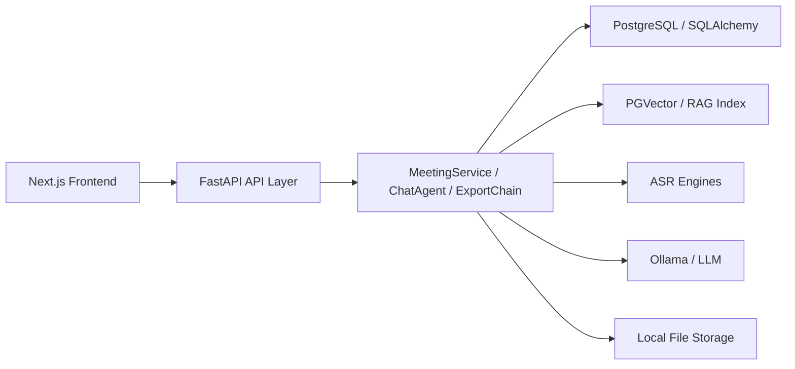

# Meeting Agent 迁移到 Next.js + TypeScript + React + FastAPI 完整方案

## 1. 目标与结论

本方案用于将当前基于 `Streamlit` 的单体前端，迁移为：

- 前端：`Next.js + React + TypeScript`
- 后端接口层：`FastAPI`
- 核心业务层：继续复用现有 Python 模块

结论先行：
1. 当前项目适合迁移，但本质是一次前后端分离改造，不是单纯重写页面。
2. 不建议把现有 Python 业务逻辑整体改写成 `Node.js`。
3. 最稳妥路线是保留现有 `agents/`、`services/`、`chains/`、`rag/`、`db/`，新增 API 层，再逐页迁移前端。
4. 应按“先只读页面，后长任务页面，最后聊天”的顺序推进。

---

## 2. 当前系统现状

当前入口与分层：

- `app.py`：Streamlit Web 入口
- `ui/`：页面层，包含 `home / upload / result / chat / history / stats`
- `services/meeting_service.py`：会议处理主流程
- `agents/chat_agent.py`：会议问答、多轮对话、RAG
- `db/repository.py`：数据库读写
- `chains/export_chain.py`：导出文档

当前架构特征：
1. 页面直接调用 Python 业务逻辑，不存在独立 API 层。
2. 前端状态大量依赖 `st.session_state`。
3. 上传、转写、纪要生成、RAG 建索引、导出都发生在同一进程交互链路里。
4. 聊天状态由 `ChatAgent` 的内存对象和 `Streamlit session_state` 共同承载。

这意味着：
- `Next.js` 不能直接复用当前页面层。
- 现有业务逻辑可复用，但必须包一层 API。
- 长任务和聊天必须单独设计状态模型。

---

## 3. 迁移目标

### 3.1 目标

- 保留现有会议处理能力
- 将 UI 改造成现代化前后端分离 Web 应用
- 支持更稳定的上传进度、结果页、历史页、聊天页
- 为后续扩展权限、多人协作、实时交互、任务队列预留接口

### 3.2 非目标

本轮迁移不建议同时做以下事情：
- 重写 ASR / RAG / LLM 核心逻辑
- 将 Python 业务层改成 `Node.js`
- 引入复杂微服务
- 一开始就做完整多用户权限系统

---

## 4. 目标架构

### 4.1 推荐架构



### 4.2 职责边界

`Next.js` 负责：
- 页面路由
- 表单与交互
- 状态展示
- 调用 API
- 渲染流式消息、进度、图表

`FastAPI` 负责：
- 暴露 HTTP API
- 处理上传
- 驱动长任务
- 管理任务状态
- 封装聊天会话
- 返回结构化数据

现有 Python 业务层负责：
- 音频处理
- ASR
- 纪要生成
- RAG 检索与索引
- 导出
- 数据库读写

---

## 5. 迁移原则

1. 先保留核心业务逻辑，后替换 UI。
2. 先加 API 层，不直接重写所有页面。
3. 先迁只读页面，再迁上传和聊天。
4. 新旧前端并行运行一段时间，不一次性切主入口。
5. 长任务必须有独立状态模型，不能依赖前端页面存活。

---

## 6. 页面与能力映射

### 6.1 当前页面映射

| 当前页面 | 当前文件 | 迁移后路由建议 | 复杂度 |
|---|---|---|---|
| 首页 | `ui/home.py` | `/` | 低 |
| 上传页 | `ui/upload.py` | `/meetings/new` | 高 |
| 结果页 | `ui/result.py` | `/meetings/[id]` | 中 |
| 独立问答页 | `ui/chat.py` | `/chat` | 高 |
| 历史页 | `ui/history.py` | `/meetings` | 低 |
| 统计页 | `ui/stats.py` | `/stats` | 低 |

### 6.2 能力归类

#### 低风险能力
- 首页概览
- 历史分页、筛选、删除
- 会议详情展示
- 统计图表

#### 中风险能力
- 导出文档
- 项目名编辑
- 术语词表编辑
- 原始转录浏览

#### 高风险能力
- 上传文件
- 流式转写进度
- 转写测试模式
- 重新生成纪要
- 单会 / 跨会议聊天
- RAG 引用结果展示

---

## 7. 推荐技术栈

### 7.1 前端

- `Next.js` App Router
- `React`
- `TypeScript`
- `Tailwind CSS`
- `shadcn/ui` 或自建组件库
- `TanStack Query` 负责服务端状态
- `Zustand` 或轻量 `Context` 负责局部客户端状态
- `ECharts` 或 `Recharts` 用于统计图表

### 7.2 后端

- `FastAPI`
- `Pydantic`
- 继续使用现有 `SQLAlchemy`
- 继续复用现有业务模块

### 7.3 通信模式

- 普通数据：REST API
- 长任务进度：先用轮询，后续可升级 SSE
- 聊天回复：先支持普通响应，建议二期支持流式返回

---

## 8. 后端 API 设计

### 8.1 API 分组

建议新增目录：

```text
api/
  app.py
  deps.py
  routers/
    health.py
    meetings.py
    jobs.py
    chat.py
    stats.py
    templates.py
  schemas/
    common.py
    meetings.py
    jobs.py
    chat.py
    stats.py
  services/
    job_manager.py
    chat_session_manager.py
```

### 8.2 核心接口清单

#### 健康检查
- `GET /api/health`

返回：

```json
{
  "status": "ok"
}
```

#### 会议列表与详情
- `GET /api/meetings`
- `GET /api/meetings/{meeting_id}`
- `GET /api/meetings/{meeting_id}/transcript`
- `DELETE /api/meetings/{meeting_id}`
- `PATCH /api/meetings/{meeting_id}/project-name`

`GET /api/meetings` 查询参数建议：
- `page`
- `page_size`
- `search`
- `duration`
- `environment`

#### 上传与处理任务
- `POST /api/meetings/process`
- `GET /api/jobs/{job_id}`
- `GET /api/jobs/{job_id}/events`，二期可做 SSE

`POST /api/meetings/process` 使用 `multipart/form-data`：
- `file`
- `title`
- `meeting_date`
- `meeting_time`
- `output_format`
- `scene`
- `custom_headings`
- `asr_model`
- `terms`
- `chunk_strategy`
- `transcription_mode`
- `template_file` 或 `template_name`

返回：

```json
{
  "job_id": "uuid",
  "status": "pending"
}
```

#### 会议结果再生成
- `POST /api/meetings/{meeting_id}/regenerate`

用于：
- 更新术语词表后重新跑 ASR + LLM
- 重新生成纪要、待办、决议

#### 导出
- `POST /api/meetings/{meeting_id}/exports`
- `GET /api/meetings/{meeting_id}/exports/{export_id}/download`
- `GET /api/templates`

#### 统计
- `GET /api/stats/overview`

#### 聊天
- `POST /api/chat/sessions`
- `POST /api/chat/sessions/{session_id}/messages`
- `GET /api/chat/sessions/{session_id}`
- `DELETE /api/chat/sessions/{session_id}`

`POST /api/chat/sessions` 请求示例：

```json
{
  "mode": "single",
  "meeting_id": 123
}
```

或：

```json
{
  "mode": "cross"
}
```

`POST /api/chat/sessions/{session_id}/messages` 请求示例：

```json
{
  "message": "这次会议的主要待办事项是什么？"
}
```

响应示例：

```json
{
  "assistant_message": "……",
  "rag_results": [
    {
      "meeting_title": "项目周会",
      "chunk_type_label": "纪要",
      "text": "……",
      "score": 0.91
    }
  ],
  "memory": {
    "round_count": 3,
    "max_rounds": 10,
    "is_full": false,
    "trimmed": false
  }
}
```

---

## 9. 长任务状态模型

这是本次迁移最关键的部分之一。

当前 `Streamlit` 直接在页面进程里跑：
- 文件保存
- 音频预处理
- ASR
- 纪要生成
- 摘要生成
- 数据库存储
- RAG 建索引
- 导出

迁移后必须把这套流程包装成任务。

### 9.1 推荐任务类型

- `meeting_process`
- `meeting_regenerate`
- `meeting_export`

### 9.2 推荐任务状态

- `pending`
- `running`
- `succeeded`
- `failed`

### 9.3 推荐进度阶段

- `uploaded`
- `transcribing`
- `analyzing`
- `generating_minutes`
- `generating_summary`
- `saving`
- `indexing`
- `exporting`
- `done`

### 9.4 推荐任务表

建议新增表 `meeting_jobs`：

| 字段 | 类型 | 说明 |
|---|---|---|
| id | UUID / VARCHAR | 任务 ID |
| job_type | VARCHAR | 任务类型 |
| status | VARCHAR | 当前状态 |
| progress_pct | INTEGER | 进度百分比 |
| stage | VARCHAR | 当前阶段 |
| message | TEXT | 状态消息 |
| meeting_id | INTEGER NULL | 关联会议 |
| result_payload | JSON/TEXT | 结果摘要 |
| error_text | TEXT | 失败原因 |
| created_at | DATETIME | 创建时间 |
| updated_at | DATETIME | 更新时间 |

如果不想第一期就改表，也可以先用进程内任务管理器做 MVP，但局限很明显：
- 服务重启后进度丢失
- 不利于并发
- 不利于恢复

建议：
- `MVP`：进程内任务管理器
- `正式版`：落库任务表

---

## 10. 聊天会话设计

当前聊天依赖：
- `Streamlit session_state`
- `ChatAgent` 实例内存
- `LangGraph MemorySaver`

迁移后建议拆成 API 会话。

### 10.1 最小可行方案
- 前端创建聊天 session
- 后端在内存里维护 `session_id -> ChatAgent`
- 单用户本地部署可接受

### 10.2 更稳妥方案
- 新增 `chat_sessions` 表存储元数据
- 消息历史持久化
- 前端只保存 `session_id`

### 10.3 推荐策略

第一期：
- 先用内存会话管理器
- 明确只支持本地单用户场景

第二期：
- 增加持久化会话表
- 支持恢复历史聊天

---

## 11. 前端页面设计

### 11.1 推荐目录结构

```text
web/
  src/
    app/
      page.tsx
      meetings/
        page.tsx
        new/
          page.tsx
        [id]/
          page.tsx
      chat/
        page.tsx
      stats/
        page.tsx
    components/
      layout/
      meetings/
      chat/
      stats/
      upload/
      common/
    lib/
      api.ts
      fetcher.ts
      routes.ts
      utils.ts
    hooks/
      useMeetings.ts
      useMeeting.ts
      useJobPolling.ts
      useChatSession.ts
    types/
      api.ts
      meeting.ts
      chat.ts
      job.ts
```

### 11.2 页面拆分建议

#### `/`
- 顶部概览指标
- 最近会议卡片
- 上传入口
- 历史入口

#### `/meetings`
- 搜索
- 时长筛选
- 环境筛选
- 分页列表
- 删除会议
- 编辑项目名

#### `/meetings/[id]`
- 会议标题、日期
- 导出操作
- 关键指标
- 待办事项
- 会议决议
- 纪要正文
- 转录展开区
- 会议内问答

#### `/meetings/new`
- 文件上传
- 标题、日期、时间
- 模板选择
- ASR 模型选择
- chunk 策略选择
- 术语词表输入
- 进度展示
- 完成后跳转详情

#### `/chat`
- 单会议问答模式
- 跨会议检索模式
- 消息流
- RAG 引用结果折叠区

#### `/stats`
- 指标卡
- 时长分布
- 环境分布
- 趋势图

---

## 12. 前后端状态映射

当前 `Streamlit` 状态与迁移后状态映射如下：

| 当前状态 | 来源 | 迁移后承载方式 |
|---|---|---|
| `st.session_state.page` | 页面路由 | Next.js 路由 |
| `data` | 页面内结果缓存 | React Query + meeting detail API |
| `segments` | 页面内缓存 | transcript API |
| `output_path` | 本地文件路径 | export resource / download API |
| `result_agent` | 内存对象 | chat session API |
| `chat_messages` | session_state | 前端消息 state + 后端 session |
| 上传进度 | callback | jobs API polling / SSE |

---

## 13. 后端改造清单

### 13.1 第一层：不动核心逻辑

尽量不改：
- `services/meeting_service.py`
- `agents/chat_agent.py`
- `chains/export_chain.py`
- `db/repository.py`

### 13.2 第二层：新增适配层

新增适配层负责把现有方法包装成 API 服务。

建议新增：
- `job_manager.py`
- `chat_session_manager.py`
- `api routers`
- `pydantic schemas`

### 13.3 必要的后端改造点

#### 必做
- 为 `MeetingRepository` 增加更清晰的分页、详情 DTO 输出
- 为上传处理增加任务封装
- 为聊天增加 session 管理
- 为导出增加文件下载接口

#### 建议做
- 为 `MeetingService.process_stream()` 提供任务回调适配
- 将页面层里零散的再生成逻辑收敛到服务层
- 将错误转换为统一 API 错误格式

---

## 14. 完整迁移顺序

以下顺序是可执行版本，不是高层概念版本。

### 阶段 0：冻结范围与基线确认

目标：
- 明确首批必须迁移的页面和能力
- 记录现有页面行为作为验收基线

任务：
- 列出现有页面和每个按钮的行为
- 录制关键流程
- 补充最少量回归测试

产出：
- 页面功能清单
- 迁移验收清单

### 阶段 1：新增 FastAPI 骨架

目标：
- 在不影响 `Streamlit` 的情况下，跑通 API 服务

任务：
- 新增 `api/app.py`
- 新增健康检查接口
- 配置依赖注入
- 跑通本地启动脚本

验收：
- `GET /api/health` 正常返回
- Streamlit 仍可运行

### 阶段 2：先做只读 API

目标：
- 先把最容易复用的读取能力接口化

任务：
- `GET /api/meetings`
- `GET /api/meetings/{id}`
- `GET /api/meetings/{id}/transcript`
- `GET /api/stats/overview`
- `PATCH /api/meetings/{id}/project-name`
- `DELETE /api/meetings/{id}`

验收：
- 历史列表、详情、统计数据均可通过 API 获取

### 阶段 3：搭建 Next.js 前端骨架

目标：
- 建立新前端基础工程

任务：
- 创建 `web/` 工程
- 配置 TypeScript、Tailwind、组件体系
- 建立 API 客户端
- 建立类型定义
- 建立错误处理和加载状态

验收：
- 前端可启动
- 可调用健康检查和只读接口

### 阶段 4：迁移低风险页面

顺序建议：
1. 首页
2. 历史页
3. 详情页只读部分
4. 统计页

任务：
- 还原页面信息结构
- 对接只读 API
- 建立统一布局和导航

验收：
- 四个页面可在 Next.js 正常使用
- 数据与 Streamlit 展示一致

### 阶段 5：建立长任务基础设施

目标：
- 为上传和重新生成提供统一任务通道

任务：
- 实现 `job_manager`
- 实现 `POST /api/meetings/process`
- 实现 `GET /api/jobs/{job_id}`
- 定义进度阶段和错误格式

验收：
- 能创建任务
- 能轮询进度
- 能在完成后拿到 `meeting_id`

### 阶段 6：迁移上传页

任务：
- 文件上传表单
- 模板选择
- ASR 模型选择
- chunk 策略
- 术语词表
- 进度轮询
- 成功后跳转详情页

验收：
- 从上传到结果页的主链路跑通
- 失败时有清晰错误提示

### 阶段 7：迁移详情页的编辑与导出

任务：
- 术语词表编辑
- 重新生成纪要
- 导出不同格式
- 转录搜索

验收：
- 导出能力与旧版一致
- 重新生成后详情页自动刷新

### 阶段 8：迁移聊天功能

任务：
- 单会议聊天会话
- 跨会议检索模式
- RAG 引用结果展示
- 轮数和裁剪提示
- 可选流式消息

验收：
- 单会议与跨会议模式都可用
- 返回结构和旧行为对齐

### 阶段 9：灰度切换

任务：
- 新旧前端并行运行
- 关键路径对比验收
- 修复问题

验收：
- 主要链路稳定
- 用户可不依赖 Streamlit 完成所有核心流程

### 阶段 10：下线旧 UI

任务：
- 移除 `Streamlit` 作为主入口
- 保留 CLI 和核心业务层
- 文档更新

验收：
- 新前端为默认入口
- 文档、启动方式、部署方式已更新

---

## 15. 推荐实施顺序总结

如果只看最重要的执行顺序，压缩版如下：

1. 盘点页面与能力边界
2. 新增 FastAPI 骨架
3. 先做只读 API
4. 搭建 Next.js 前端骨架
5. 先迁首页 / 历史页 / 详情页 / 统计页
6. 再做任务系统
7. 再迁上传页
8. 再迁详情页编辑与导出
9. 最后迁聊天
10. 新旧并行验收后下线 Streamlit

---

## 16. 数据库与模型建议

### 16.1 当前可直接复用
- `meetings`
- `transcriptions`
- `meeting_chunks`

### 16.2 建议新增
- `meeting_jobs`
- 可选 `chat_sessions`
- 可选 `chat_messages`

### 16.3 不建议第一期强做
- 复杂权限模型
- 多租户
- 分布式任务队列

---

## 17. 错误处理规范

建议统一返回：

```json
{
  "error": {
    "code": "MEETING_NOT_FOUND",
    "message": "会议不存在",
    "details": null
  }
}
```

常见错误码建议：
- `VALIDATION_ERROR`
- `UPLOAD_FAILED`
- `JOB_NOT_FOUND`
- `MEETING_NOT_FOUND`
- `EXPORT_FAILED`
- `CHAT_SESSION_NOT_FOUND`
- `LLM_UNAVAILABLE`
- `ASR_UNAVAILABLE`

---

## 18. 测试与验收

### 18.1 接口测试
- 健康检查
- 会议列表 / 详情
- 上传并创建任务
- 查询任务状态
- 导出
- 聊天

### 18.2 前端验收
- 首页卡片、最近会议
- 历史页筛选、分页、删除
- 详情页展示
- 上传链路
- 聊天链路
- 统计图表

### 18.3 回归重点
- 缓存命中逻辑
- 术语词表生效
- 删除会议后向量索引清理
- 重新生成纪要
- 单会议与跨会议聊天差异

---

## 19. 主要风险与应对

### 风险 1：长任务阻塞请求

原因：
- ASR 和 LLM 都可能较慢

应对：
- 后端任务化
- 前端轮询进度
- 不把长任务放在 Next.js server action 内执行

### 风险 2：聊天状态丢失

原因：
- 当前聊天依赖内存对象

应对：
- 增加 `session_id`
- 会话由后端统一持有

### 风险 3：上传与模板逻辑过于耦合页面

原因：
- 目前很多上传逻辑直接写在 Streamlit 页面里

应对：
- 先在 FastAPI 中重建上传 DTO 和任务入口
- 逐步下沉表单校验

### 风险 4：一次性全量迁移导致回退困难

应对：
- 新旧前端并行
- 分阶段切换

---

## 20. 推荐排期

如果按单人开发估算，建议按以下节奏安排：

- 第 1 周：API 骨架 + 只读接口 + Next.js 骨架
- 第 2 周：首页 / 历史页 / 详情页 / 统计页
- 第 3 周：任务系统 + 上传页
- 第 4 周：导出、重新生成、聊天
- 第 5 周：联调、验收、切换

如果是课程项目或演示版本，可压缩为：
- 先完成只读页面
- 上传页只做轮询
- 聊天先不做流式

---

## 21. 最终建议

这次迁移最重要的不是“把页面改成 React”，而是把现在 `Streamlit` 里隐含的三件事显式化：
1. 页面路由
2. 后端接口
3. 长任务状态

只要这三层拆开，当前项目迁到 `Next.js + TypeScript + React + FastAPI` 是顺的。
如果跳过 API 设计、任务状态设计，直接重写页面，后面一定会卡在上传和聊天上。

建议实际开工顺序：
1. 先起 FastAPI
2. 先做只读 API
3. 先迁低风险页面
4. 再做任务系统
5. 最后做上传和聊天

---

## 22. 可直接执行的首批任务

如果下一步要真正开工，建议按这个顺序建任务：
1. 新建 `api/app.py` 和 `health` 路由
2. 为会议列表、详情、统计补 REST API
3. 新建 `web/` 的 Next.js 工程
4. 做首页和历史页
5. 做详情页只读版
6. 做 `job_manager`
7. 做上传任务 API
8. 做上传页
9. 做导出和重新生成
10. 做聊天 API 与聊天页

---

## 23. 当前迁移落地状态（2026-06-14）

本方案对应的迁移实现已经在新目录中完成主要链路落地：

- 实现目录：`C:\Users\Administrator\Desktop\meeting-agent\migration\nextjs-fastapi`
- 保留旧版入口：`C:\Users\Administrator\Desktop\meeting-agent\app.py`
- 当前策略：新旧前端并行，不直接替换旧版

当前已完成的关键能力包括：

- 只读页面：首页、历史页、详情页、统计页
- 编辑能力：历史页删除会议、项目名编辑
- 上传能力：模板选择、模板预览、完整提交处理链路
- 详情能力：导出下载、重新生成纪要
- 聊天能力：单场问答、跨会议问答、来源跳转与定位增强
- 验收能力：Playwright 纯点击验收已覆盖主要页面

建议把后续工作重点放在：

1. 并行观察期稳定性验证
2. 视觉与交互细节对齐
3. 默认入口切换与回退预案

并行验收结论请参考：
`C:\Users\Administrator\Desktop\meeting-agent\docs\nextjs-fastapi-parallel-validation-summary.md`
