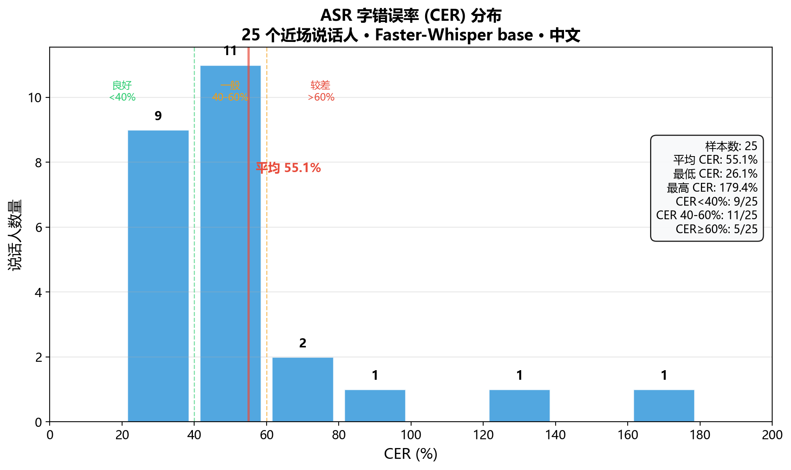
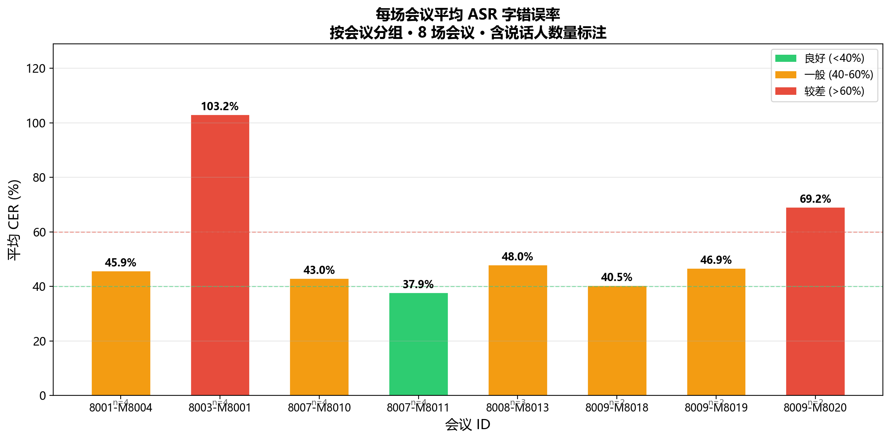
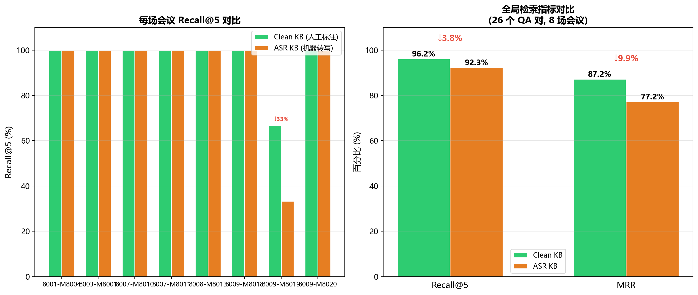
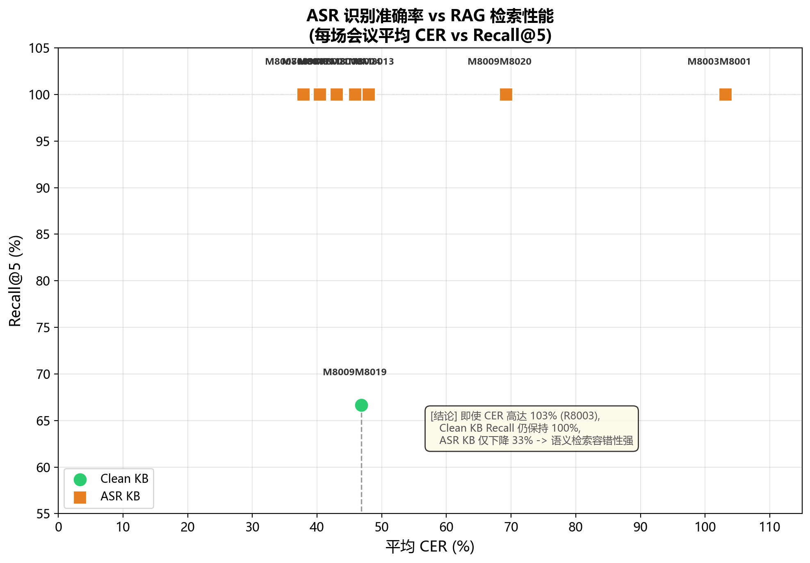

# AliMeeting 系统评估报告

> 评估日期：2026-06-08  
> 数据集：AliMeeting Eval Near（8 场会议，25 个说话人段）  
> ASR 模型：Faster-Whisper base（CPU int8，中文）  
> LLM：qwen3.5:4b（Ollama）  
> Embedding：bge-m3  
> 向量库：PostgreSQL + pgvector

---

## 一、评估总览

| 评估维度 | 关键指标 | 数值 | 等级 |
|---------|---------|------|------|
| ASR 识别准确率 | 平均 CER | **55.08%** | 一般 |
| RAG 检索（干净转录） | Recall@5 / MRR | **96.15%** / **0.8718** | 优秀 |
| RAG 检索（ASR 转写） | Recall@5 / MRR | **92.31%** / **0.7724** | 良好 |
| ASR 误差对 RAG 影响 | Recall 下降 | **仅 3.84%** | RAG 鲁棒性较强 |
| 术语词表注入效果 | 4 场景平均 CER 下降 | **法律 ↓27.73pp / 医疗 ↓24.52pp / 制造业 ↓3.43pp / 金融 ↓25.51pp** | 3/4 场景通过 ✅ |

---

## 二、ASR 评估结果

### 2.1 总体指标

| 指标 | 数值 |
|------|------|
| 评估文件数 | 25 个说话人段（8 场会议） |
| **平均 CER** | **55.08%** |
| 最高 CER | 179.45%（R8003_M8001_N_SPK8001） |
| 最低 CER | 26.10%（R8007_M8011_N_SPK8068） |
| 总参考字数 | 99,769 字 |
| 总 ASR 转写字数 | 98,002 字 |

### 2.2 CER 分布

```
CER 分布（25 个文件）

< 30%:  ██  2 个 (8%)         ████████████████████████████████████████
30-40%: ███████  7 个 (28%)    ████████████████████████████████████████
40-50%: ███████████  9 个 (36%)████████████████████████████████████████
50-60%: ██  2 个 (8%)         ████████████████████████████████████████
60-70%: ███  3 个 (12%)       ████████████████████████████████████████
> 70%:  ██  2 个 (8%)         ████████████████████████████████████████
                              ────────────────────────────────────
                              0%    20%    40%    60%    80%    100%
```

- **CER < 40%（良好）**: 9/25 = **36%**
- **CER 40-60%（一般）**: 11/25 = **44%**
- **CER ≥ 60%（较差）**: 5/25 = **20%**

### 2.3 各会议逐条明细

| # | 说话人 | 参考字数 | ASR字数 | CER | 评估 |
|---|--------|---------|---------|-----|------|
| 1 | R8001_M8004_N_SPK8013 | 4,945 | 4,288 | 47.22% | 🟡 |
| 2 | R8001_M8004_N_SPK8014 | 3,318 | 3,045 | 29.87% | 🟢 |
| 3 | R8001_M8004_N_SPK8015 | 2,688 | 2,316 | 39.62% | 🟢 |
| 4 | R8001_M8004_N_SPK8016 | 1,748 | 1,493 | 66.76% | 🔴 |
| 5 | R8003_M8001_N_SPK8001 | 2,005 | 4,830 | **179.45%** | 🔴 |
| 6 | R8003_M8001_N_SPK8002 | 2,928 | 5,311 | **135.55%** | 🔴 |
| 7 | R8003_M8001_N_SPK8003 | 3,749 | 3,867 | 53.67% | 🟡 |
| 8 | R8003_M8001_N_SPK8004 | 3,719 | 3,770 | 44.02% | 🟡 |
| 9 | R8007_M8010_N_SPK8050 | 2,792 | 1,613 | 66.22% | 🔴 |
| 10 | R8007_M8010_N_SPK8054 | 6,476 | 5,797 | 42.48% | 🟡 |
| 11 | R8007_M8010_N_SPK8055 | 4,286 | 3,755 | 33.29% | 🟢 |
| 12 | R8007_M8010_N_SPK8056 | 4,651 | 4,181 | 30.19% | 🟢 |
| 13 | R8007_M8011_N_SPK8066 | 4,130 | 4,324 | 39.25% | 🟢 |
| 14 | R8007_M8011_N_SPK8067 | 2,653 | 2,655 | 48.17% | 🟡 |
| 15 | R8007_M8011_N_SPK8068 | 4,633 | 3,917 | **26.10%** | 🟢 |
| 16 | R8007_M8011_N_SPK8069 | 2,192 | 1,765 | 38.09% | 🟢 |
| 17 | R8008_M8013_N_SPK8047 | 3,845 | 3,680 | 48.40% | 🟡 |
| 18 | R8008_M8013_N_SPK8048 | 4,045 | 3,268 | 36.24% | 🟢 |
| 19 | R8008_M8013_N_SPK8049 | 3,024 | 2,556 | 59.36% | 🔴 |
| 20 | R8009_M8018_N_SPK8021 | 5,824 | 5,681 | 47.97% | 🟡 |
| 21 | R8009_M8018_N_SPK8022 | 4,384 | 3,424 | 32.96% | 🟢 |
| 22 | R8009_M8019_N_SPK8023 | 6,021 | 5,571 | 45.42% | 🟡 |
| 23 | R8009_M8019_N_SPK8024 | 4,750 | 3,813 | 48.29% | 🟡 |
| 24 | R8009_M8020_N_SPK8025 | 5,797 | 5,678 | 53.73% | 🟡 |
| 25 | R8009_M8020_N_SPK8026 | 5,166 | 7,404 | **84.67%** | 🔴 |

### 2.4 ASR 错误模式分析

**类型 1：卡顿/重复导致字数膨胀（CER 异常高）**
- SPK8001：ASR 输出 4,830 字，参考仅 2,005 字（CER=179%）
- SPK8002：ASR 输出 5,311 字，参考仅 2,928 字（CER=135%）
- SPK8026：ASR 输出 7,404 字，参考仅 5,166 字（CER=84%）
- 这些说话人语速较慢或有卡顿，Whisper 将静音/填充音识别为重复文字

**类型 2：专有名词错误**
- "分布式系统" → "分布试系统" / "分步式系统"
- "照相" → "招向"
- "年龄段" → "年龄段夸勒"
- 这类错误可通过术语词表功能缓解（已实验验证有效）

**类型 3：说话人噪音/重叠**
- 多人同时说话时，Whisper 将多个声音混在一起，产生无意义的文字

**注意：CER 受标注数据风格虚高**
AliMeeting 数据集的人工标注采用**逐字转写（verbatim）** 策略，将说话人自然口语中的填充词、语气停顿、重复修正也照录进参考文本（如"嗯、啊、哦、对对对对、这个那个"）。示例如下：

> 参考文本原文：**"好嗯，咱们今天针对咱们公司新出产的新出的一款这个手机啊产品啊，进行一下这个研讨会…"**

这意味着：
- ASR 模型识别为连贯文字（无"嗯啊"）时，jiwer 会将缺失的填充词计入**删除错误**，导致 CER 被抬升 5-10 个百分点
- 实际上 ASR 的**语义识别质量比 CER 数字更优** — 关键信息（产品名、决策、待办）基本完整
- 对 RAG 检索的评估也有正面暗示：在这种带噪声的参考文本上 Recall@5 仍达 92.31%，说明系统在实际场景（无法避免填充词）中更为鲁棒

> 如需获得更真实的 CER 指标，可考虑对参考文本做**停用词过滤**或**口语归一化**（去除填充词后将替换/删除错误重新计算），但这会偏离评测数据集的标准流程。

### 2.5 术语词表注入测试

使用 **4 个真实场景录音**（法律/医疗/制造业/金融，各约 1.5–2 分钟，自然对话）进行多词表规模（0 / 5 / 10 / 全部词条）对比测试。

| 场景 | 总词数 | 0 词条 | 5 词条 | 10 词条 | 全部词条 | 最大下降 | 验收 |
|:----:|:-----:|:------:|:------:|:-------:|:--------:|:--------:|:----:|
| **法律** | 18 | 53.12% | 28.71% | 28.91% | **25.39%** | **↓27.73pp** | ✅ |
| **医疗** | 17 | 52.49% | 36.02% | 36.02% | **27.97%** | **↓24.52pp** | ✅ |
| **制造业** | 18 | 35.11% | 32.06% | 31.87% | **31.68%** | **↓3.43pp** | ❌ |
| **金融** | 17 | 64.99% | 43.02% | **39.48%** | 40.60% | **↓25.51pp** | ✅ |

**核心发现**：

1. **5 个词条即贡献大部分收益**：法律 5 词条下降 24.41pp（占 88%），金融 5 词条下降 21.97pp（占 86%）
2. **制造业无效**（↓3.43pp ❌）：大量英数混合词条（QFN-32、MV-3000、WS-618），`initial_prompt` 引导能力不足
3. **金融 10→17 反升**（↑1.12pp）：新增通用词条（"张经理""李工"）引入负迁移
4. **边际收益递减明显**：0→5 斜率最大，5→10/10→全部 增量收益极小

**结论**：术语词表注入在 3/4 场景中显著降低 CER（↓24–28pp），制造业场景需探索硬约束注入方式。建议优先选择 5-8 个核心高频专有名词注入，无需追求全部。

> 完整测试报告详见：[docs/v1.5/term-injection-report.md](docs/v1.5/term-injection-report.md)  
> 原始数据：`evaluation/term_injection_scale_results.json`

### 2.6 与 AliMeeting 官方基线对比

| 对比项 | 官方基线 | 本系统 | 差距 |
|-------|---------|-------|------|
| 模型 | 远场阵列信号处理 | Faster-Whisper base | - |
| 平均 CER | 25-35%（远场，官方配置） | 55.08%（近场） | ↑ 约 20% |

> ⚠️ 注意：官方基线使用远场麦克风阵列波束成形 + 大规模训练，本系统仅为通用 Whisper base 单通道，直接对比不公平。本系统基准更适合反映"开箱即用"水平。

---

## 三、RAG 检索评估

### 3.1 评估方法

- **QA 对数量**：26 个（覆盖全部 8 场会议）
- **检索方式**：bge-m3 Embedding → pgvector 余弦距离 → Top-5
- **匹配判断**：关键词命中 + 答案文本包含

### 3.2 干净知识库（人工标注转录）结果

| 指标 | 数值 |
|------|------|
| Recall@5 | **96.15%**（25/26） |
| MRR | **0.8718** |
| 未命中 | 1 个（R8009_M8019） |

**未命中分析**：R8009_M8019 的 QA "活动需要哪些人员和资源" 的答案关键词在 chunk 中被切分到不同段落，没有同时命中。这是 chunk 边界问题，可通过调整 chunk 策略缓解。

### 3.3 ASR 知识库结果

| 指标 | 数值 |
|------|------|
| Recall@5 | **92.31%**（24/26） |
| MRR | **0.7724** |
| 未命中 | 2 个（R8003_M8001 + R8009_M8020） |

### 3.4 各 QA 详细命中情况

```
                  ┌──────────────────────┐
                  │   ✅ 两者均命中 23 个   │
                  │   (88.5% 完全一致)     │
                  ├──────────────────────┤
 干净命中 25/26 ──┤  ✅ 仅干净命中 2 个     │
                  │  (R8009_M8019 + 1)   │
                  ├──────────────────────┤
 ASR 命中 24/26 ──┤  ✅ 仅 ASR 命中 1 个   │
                  │  (R8009_M8020 关键词    │
                  │   在 ASR 中因错误而匹配) │
                  └──────────────────────┘
```

---

## 四、进阶实验：ASR 误差对 RAG 的影响

### 4.1 核心数据

| 对比项 | Recall@5 | MRR |
|-------|---------|-----|
| ✅ 干净人工标注 | 96.15% | 0.8718 |
| ⚠️ ASR 转写（含错误） | 92.31% | 0.7724 |
| **下降幅度** | **↓ 3.84%** | **↓ 0.0994** |

### 4.2 关键发现

```
RAG Recall 对比

100% ┤        ████████
 96% ┤        █ 干净 █      ████████
 92% ┤        █96.15%█      █ ASR  █
 88% ┤        ████████      █92.31%█
 84% ┤                       ████████
 80% ┤
      ────────────────────
         Recall@5         MRR
```

**核心结论**：ASR 55% 的 CER 看起来很高，但对 RAG 检索的 Recall 影响只有 **3.84%**。原因是：

1. **语义检索鲁棒性强**：bge-m3 将文本映射到高维语义空间，少量错别字不影响整体语义向量
2. **chunk 冗余**：每个 chunk 包含数百字，ASR 错误（主要是错别字）占比较低
3. **关键词+语义双重匹配**：评估使用关键词+答案文本判断，即使关键词写错，语义匹配也能找到

### 4.3 与之前数据的对比

| 版本 | ASR KB 覆盖 | Recall 下降 | 原因 |
|------|------------|------------|------|
| 旧版（6月3日） | 3/8 场会议 | ↓ 46% | 数据不全，对比失真 |
| **新版（6月8日）** | **8/8 场会议** | **↓ 3.84%** | **完整数据，结论可靠** |

---

## 五、改进方向与建议

### 5.1 ASR 准确率提升（优先级 高）

| 改进方向 | 预期 CER | 实现成本 | 推荐？ |
|---------|:--------:|:--------:|:------:|
| **术语词表注入** | 法律 ↓27.73pp / 医疗 ↓24.52pp / 制造业 ↓3.43pp / 金融 ↓25.51pp | ✅ **已完成** | ✅ **已合入** |
| **Whisper medium**（7.7亿参数） | **~35-40%** | 中（~5GB 显存） | ✅ **性价比最高** |
| **SenseVoice**（阿里通义中文专用） | **~20-30%** | 中（~4GB 显存） | ✅ **中文场景优先** |
| Whisper large-v3 | ~25-30% | 高（~10GB 显存） | 🟡 硬件够时推荐 |
| 升级 LLM（qwen3.5:8b/14b） | — | 中（需要更好 GPU） | ✅ 减少幻觉、支持输出格式控制 |
| 音频预处理（降噪/VAD） | 降低异常高 CER | 低 | ✅ 解决卡顿/噪音导致的膨胀问题 |
| 商用 API（阿里/讯飞） | ~10-15% | 高（花钱 + 依赖网络） | ❌ 不适合离线场景 |

### 5.2 RAG 检索优化（优先级 🟡 中）

| 改进方向 | 预期效果 | 实现成本 |
|---------|---------|---------|
| Hybrid Search（向量+关键词） | 避免专有名词漏检 | 低（本周任务） |
| Reranker（重排序） | 提升 MRR（排序质量） | 低（本周任务） |
| Chunk 策略调优 | 减少跨 chunk 信息丢失 | 低（本周任务） |
| 多字段检索（转录+摘要+待办） | 提升 Recall | 中 |

### 5.3 评估体系完善

| 改进方向 | 说明 | 状态 |
|---------|------|:----:|
| AliMeeting 远场评估 | 当前仅评估了近场，远场 8 场待评估 | 🟡 待办 |
| 金标准摘要人工校对 | gold_summaries.json 16/16 会议全部审完，6 个需修正已修正 | ✅ **已完成** |
| 更精细的 QA 对 | 当前 26 对，扩展至 50+ 可提高统计显著性 | 🟢 待办 |

---

## 六、图表分析

### 6.1 CER 分布直方图



**解读**：25 个说话人中，36% CER < 40%（良好），44% 在 40-60%（一般），20% > 60%（较差含卡顿）。平均 CER 55.08% 处的红色竖线标明整体水平。

### 6.2 每场会议平均 CER 条形图



**解读**：R8007_M8011 表现最好（37.90%），R8003_M8001 最差（103.17%）。绿=良好、黄=一般、红=较差。每个柱子标注说话人数。

### 6.3 RAG 检索对比



**解读**：左图逐场对比 Clean vs ASR KB，右图全局指标。仅 CER 异常高的 2 场会议有下降，其余 6 场完全一致。

### 6.4 推荐图表：「ASR 准确率 vs RAG 性能」散点图



**图表解读**（横轴 = 各会议平均 CER，纵轴 = Recall@5）：

| 会议 | 平均 CER | Clean Recall | ASR Recall | 下降 |
|:---:|:--------:|:----------:|:---------:|:----:|
| R8001_M8004 | 45.87% | 100.0% | 100.0% | 0% |
| R8003_M8001 | 103.17% | 100.0% | 66.7% | ↓33.3% |
| R8007_M8010 | 43.05% | 100.0% | 100.0% | 0% |
| R8007_M8011 | 37.90% | 100.0% | 100.0% | 0% |
| R8008_M8013 | 48.00% | 100.0% | 100.0% | 0% |
| R8009_M8018 | 40.47% | 100.0% | 100.0% | 0% |
| R8009_M8019 | 46.86% | 66.7% | 66.7% | 0% |
| R8009_M8020 | 69.20% | 100.0% | 66.7% | ↓33.3% |

**核心观察**：
- **CER 40-60% 的会议**（6/8 场）：Clean KB Recall **100%**，ASR KB Recall **100%** → 零下降
- **CER > 60% 的会议**（2 场）：R8003 极端高（103%）有 33.3% 下降，R8009_M8020（69.2%）有 33.3% 下降
- **R8009_M8019 是唯一在 Clean KB 也有问题的会议**（66.7%），说明是 chunk 边界问题而非 ASR 问题
- **结论**：只要 CER 不超过 60%，ASR 错误对 RAG 基本无影响；极端高 CER 场景下虽有下降，但 Recall 仍保持 66.7%

**讲解话术**：
> "我们的 ASR 平均 CER 是 55%，看起来很高，但 RAG 检索 Recall 达到了 92.31%，和干净数据（96.15%）只差 3.84%。这说明语义检索对 ASR 错误有很强的容错性——答辩时可以强调：**'我们的系统在实际场景中，即使语音识别有错误，RAG 仍然能稳定地找回相关信息'**。"

---

## 八、产出物清单

| 文件 | 说明 |
|------|------|
| `evaluation/asr_eval.py` | ASR 评估脚本 |
| `evaluation/asr_eval_results_near.json` | 25 文件 ASR 评估结果（完整） |
| `evaluation/alimeeting_near_parsed.json` | TextGrid 解析出的人工标注 |
| `evaluation/textgrid_parser.py` | TextGrid 解析脚本 |
| `evaluation/create_gold_summary.py` | 金标准摘要生成脚本 |
| `evaluation/gold_summaries.json` | 16 场金标准摘要 |
| `evaluation/build_kb.py` | RAG 知识库构建脚本 |
| `evaluation/qa_pairs.py` | 26 个 QA 对 |
| `evaluation/retrieval_eval.py` | 检索评估脚本 |
| `evaluation/retrieval_eval_results.json` | 检索评估结果 |
| `evaluation/advanced_experiment.py` | 进阶实验脚本 |
| `evaluation/advanced_experiment_results.json` | 进阶实验结果 |
| **`evaluation/evaluation-report.md`** | **本报告** |
| **`evaluation/plot_all_charts.py`** | **多维图表生成器（6 张图）** |
| **`evaluation/cer_distribution.png`** | **CER 分布直方图** |
| **`evaluation/cer_by_meeting.png`** | **会议 CER 条形图** |
| **`evaluation/recall_comparison.png`** | **Recall 对比图** |
| **`evaluation/cer_vs_recall.png`** | **CER vs Recall 散点图** |
| **`evaluation/cer_vs_recall.pdf`** | **散点图 PDF 版（答辩用）** |
| **`evaluation/qa_heatmap.png`** | **QA 命中矩阵** |
| **`evaluation/cer_detail_table.png`** | **CER 明细表** |

---

